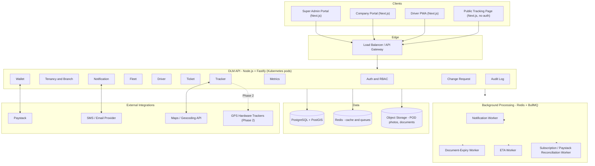
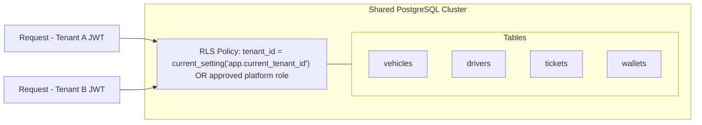
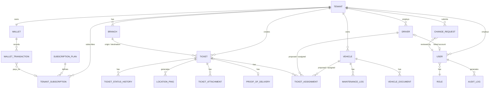
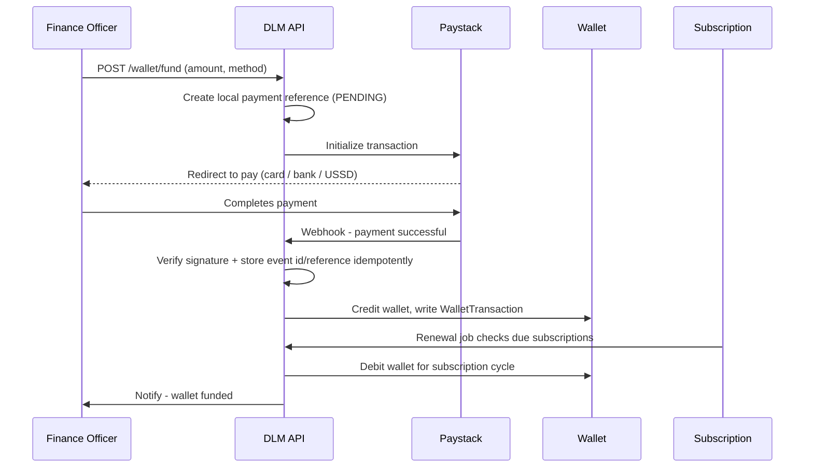
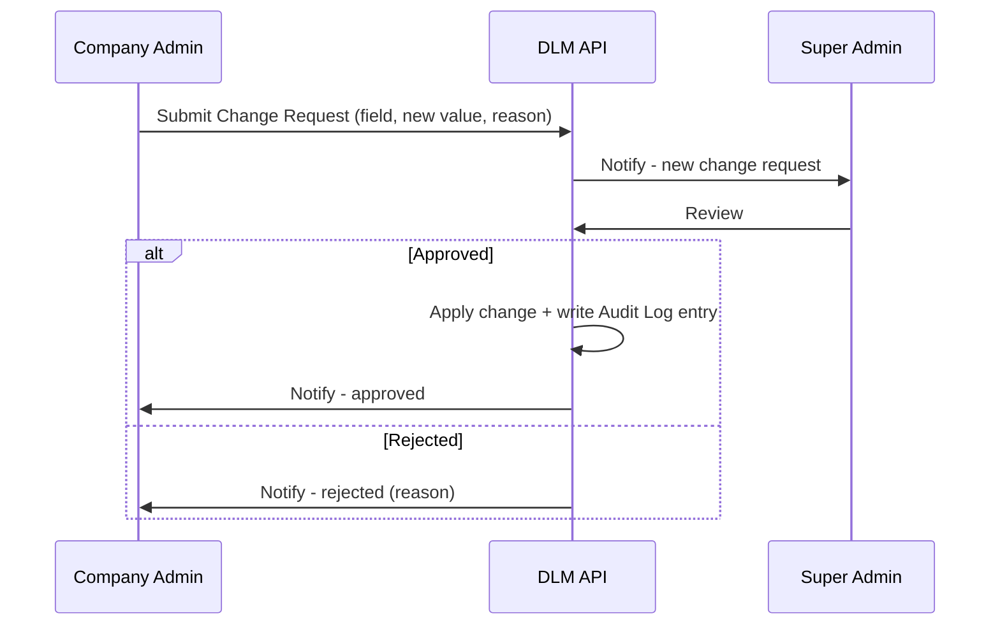

# Software Design Document (SDD)
# Da Logistics Manager (DLM)

**Document Control**

| Field | Value |
|---|---|
| Product | Da Logistics Manager (DLM) |
| Owner / Operator | Zarox IT Solutions Limited |
| Document Version | 0.1 (Draft) |
| Date | July 3, 2026 |
| Status | Draft — for review |
| Implements | `DLM_SRD.md` |
| Related Documents | `DLM_Screens.md`, `DLM_DTOs.md` |

---

## 1. Introduction
This document translates the requirements in `DLM_SRD.md` into a technical architecture and design: system structure, data model, API design, security design, and deployment approach.

---

## 2. Architecture Overview

DLM is a modular monolith at the API layer (fast to build and operate at MVP scale, with clean internal module boundaries that allow extraction into services later if needed), fronted by a Next.js + TypeScript App Router frontend that serves the Super Admin portal, Company portal, Driver PWA, and public tracking page, backed by PostgreSQL and Redis, deployed on Kubernetes.



### 2.1 Multi-Tenancy Strategy
DLM uses a **shared database, shared schema** model: every tenant-scoped table carries a `tenant_id` column. Two layers of enforcement are used:

1. **Application layer** — every query is built through a repository layer that injects `tenant_id` from the authenticated JWT; there is no code path that queries tenant-scoped tables without it.
2. **Database layer** — PostgreSQL Row-Level Security (RLS) policies on every tenant-scoped table, keyed to transaction-scoped session variables (`app.current_tenant_id`, `app.current_platform_role`) set with `SET LOCAL` per request, as defense-in-depth against application bugs and pooled-connection leakage.



Platform-level tables (tenant registry, platform users, subscription plans) are not tenant-scoped and are only reachable by Platform roles. Super Admin has full cross-tenant administrative access. Platform Support has read-only cross-tenant access, including PII and wallet data, and is blocked at the RBAC/service layer from approvals, wallet adjustments, and operational mutations.

### 2.2 Deployment Architecture
- **Environments**: `dev`, `staging`, `production`, each a separate Kubernetes namespace.
- **API**: stateless Fastify pods behind an ingress/load balancer, horizontally scaled via HPA on CPU/request-rate.
- **Workers**: separate deployment from the API, scaled independently based on queue depth.
- **Database**: managed PostgreSQL with PostGIS enabled, daily backups, point-in-time recovery.
- **Secrets**: managed via Kubernetes Secrets or a vault (e.g., Doppler/HashiCorp Vault), never committed to source control.

---

## 3. Technology Stack

| Layer | Technology | Rationale |
|---|---|---|
| Backend API | Node.js + TypeScript + Fastify | Fastify's low overhead and schema-based validation suit a high-write, multi-module logistics domain |
| Frontend (Admin, Company, Driver PWA, Public Tracking) | Next.js App Router + TypeScript | One production frontend surface with route groups, server-rendered shell/pages where useful, shared UI, and role-based routing |
| Client Validation & Forms | Zod + React Hook Form | Zod keeps frontend validation aligned with DTO/API contracts; React Hook Form keeps complex forms performant |
| Client State | Zustand | Lightweight state for role/session UI, filters, maps/tracker state, offline driver queue, and draft form state without Redux-level overhead |
| Driver App | Installable Next.js PWA for MVP | Avoids Android Studio/local native setup, ships fastest, supports camera and foreground GPS; React Native / Expo can be added later if dependable background GPS is required |
| Database | PostgreSQL + PostGIS | Relational integrity for financial/ticket data; PostGIS enables geofencing, distance, and nearest-vehicle queries |
| Cache / Queue | Redis + BullMQ | Session/rate-limit cache; reliable background jobs (notifications, expiry checks, ETA calc) |
| Real-time | WebSocket (Socket.io) | Push live vehicle locations to dashboards without polling |
| Object Storage | S3-compatible (AWS S3 / DigitalOcean Spaces) | POD photos, vehicle/driver documents, exported reports |
| Payments | Paystack | Established Nigerian rails (card, bank transfer, USSD); keeps PCI-DSS scope off DLM's servers |
| SMS / Email | Termii or Africa's Talking (SMS), SMTP provider (email) | Reliable delivery to Nigerian numbers |
| Maps / Geocoding | Google Maps Platform or Mapbox | Geocoding at registration; live map rendering; routing/ETA |
| Containerization | Docker | Environment parity dev → prod |
| Orchestration | Kubernetes | Scaling, rolling deploys, self-healing |
| CI/CD | GitHub Actions | Automated test/build/deploy |
| Observability | Prometheus + Grafana, centralized logs (Loki/ELK) | Multi-tenant load visibility, alerting |
| Analytics extension *(Phase 3)* | Python (pandas / scikit-learn) service | ML-based ETA and anomaly detection later, without forcing this into the core API's request path |

---

## 4. Component / Module Design

The API is organized as one Fastify application composed of self-contained plugins, one per SRD module (`auth`, `tenancy`, `wallet`, `subscription`, `fleet`, `driver`, `ticket`, `tracker`, `metrics`, `notification`, `change-request`, `audit`). Each plugin owns:
- its routes
- its request/response schemas (see `DLM_DTOs.md`)
- a service layer (business logic)
- a repository layer (data access, tenant-scoped)

```
/src
  /modules
    /auth
    /tenancy
    /wallet
    /subscription
    /fleet
    /driver
    /ticket
    /tracker
    /metrics
    /notification
    /change-request
    /audit
  /shared
    /middleware      (auth guard, RBAC guard, tenant-scope injector)
    /plugins         (db, redis, queue, logger)
    /dto             (shared cross-module types)
  /workers
    notification.worker.ts
    document-expiry.worker.ts
    eta.worker.ts
    subscription-renewal.worker.ts
    paystack-reconciliation.worker.ts
```

This modular-monolith structure keeps module boundaries explicit, with the option to peel any module into its own service later if load requires it. Tracker and Metrics are the most likely first candidates, given their different scaling profiles from the rest of the API.

### 4.1 Frontend Application Structure
The MVP frontend is a single Next.js App Router project under `DLM/frontend`, using TypeScript, Tailwind CSS, Zod, and Zustand. Route groups keep each client surface isolated while sharing DTOs, schemas, UI primitives, and API adapters:

```
/src
  /app
    /(company)       Company portal routes
    /(platform)      Super Admin / Platform Support routes
    /(driver)        Driver PWA routes
    /public          Public tracking routes
  /components        Shared UI and feature components
  /lib
    /schemas         Zod schemas mirroring DTO contracts
    /stores          Zustand stores
    /api             API client adapters
    /mock            Development fixtures until the live API is available
  /types             Shared TypeScript DTOs
```

Server Components should own static shells and initial read composition. Client Components are used for interactive dashboards, forms, map/tracker widgets, offline queue behavior, and Zustand-backed state.

---

## 5. Security Design

### 5.1 AuthN / AuthZ Flow
```mermaid
sequenceDiagram
    participant U as User
    participant API as DLM API
    participant DB as PostgreSQL

    U->>API: POST /auth/login (identifier, password)
    API->>DB: Look up user, verify password hash
    API-->>U: accessToken (short-lived) + refreshToken
    U->>API: Request with Authorization: Bearer accessToken
    API->>API: Verify JWT, extract userId + tenantId + role
    API->>API: RBAC guard checks role against required permission
    API->>DB: BEGIN; SET LOCAL tenant/platform context; run query (RLS enforced)
    API-->>U: Response
```

### 5.2 Data Isolation
Covered in §2.1. No tenant endpoint accepts a client-supplied `tenantId` for scoping reads/writes on tenant-scoped resources — it is always derived server-side from the authenticated session. Platform endpoints may accept `tenantId` filters only after RBAC confirms a Platform role.

### 5.3 Encryption & Secrets
- TLS 1.2+ for all traffic.
- At-rest encryption on the database volume and object storage bucket.
- Argon2id for password hashing.
- Secrets injected via environment/secret manager, never in source control.

### 5.4 Compliance Notes (NDPA 2023)
Every table holding personal data (drivers, consignees, tenant contacts) carries a `source_provenance` field recording how the data was captured (`SELF_REGISTERED`, `ADMIN_ENTERED`, `DRIVER_SUBMITTED`, `SYSTEM_CAPTURED`, `IMPORT`). Recommended retention defaults:
- Raw location pings: 90 days, then downsample to route breadcrumbs.
- Downsampled route breadcrumbs: 12 months after ticket closure.
- Ticket core records, POD, waybills, invoices, wallet transactions, and audit logs: 7 years.
- Driver PII/documents: duration of active relationship plus 2 years, unless legal hold applies.
- Consignee phone/address: mask or minimize after 24 months, while preserving accounting/ticket records required for business retention.

---

## 6. Data Architecture

### 6.1 Entity-Relationship Overview


### 6.2 Key Tables (summary — full field-level contracts in `DLM_DTOs.md`)

| Table | Notes |
|---|---|
| `tenants` | Platform-level registry; `company_name` and `status` live here |
| `branches` | `tenant_id`-scoped; geolocation stored as PostGIS `geography(Point)` |
| `users` | Platform users have `tenant_id = NULL`; tenant users carry `tenant_id` |
| `roles` | Static reference table for the 8 roles in Appendix A of the SRD |
| `subscription_plans` / `tenant_subscriptions` | Subscription-only billing model; tenant subscription state controls access to new ticket creation |
| `wallets` / `wallet_transactions` | One wallet per tenant; transactions are append-only and pay for subscription cycles |
| `payment_webhook_events` | Stores Paystack event ids/references for idempotent webhook processing and reconciliation |
| `vehicles` / `vehicle_documents` / `maintenance_logs` | `tenant_id`-scoped |
| `drivers` | `tenant_id`-scoped; optional `user_id` FK to a mobile-app account |
| `tickets` / `ticket_assignments` / `ticket_attachments` / `proofs_of_delivery` / `ticket_status_history` | `tenant_id`-scoped; assignment and status history are append-only for auditability |
| `location_pings` | High write-volume; partitioned by month, indexed on `(ticket_id, recorded_at)` |
| `change_requests` | `tenant_id`-scoped; reviewed by a Platform user |
| `notifications` | Per-user, per-tenant (nullable for platform users) |
| `audit_log` | Append-only; indexed on `(tenant_id, actor_user_id, created_at)` |

### 6.3 Location Ping Storage
Given the potentially high write rate (one row per active vehicle every 15–30 seconds), `location_pings` is time-partitioned (native PostgreSQL declarative partitioning by month, or a TimescaleDB hypertable if the extension is available). Raw pings are retained for 90 days, then downsampled to route breadcrumbs retained for 12 months after ticket closure unless a legal hold or dispute requires longer retention.

---

## 7. API Design

- Base path: `/api/v1`
- Format: JSON over HTTPS
- Auth: `Authorization: Bearer <accessToken>` on all endpoints except `/auth/*` and the public tracking endpoint
- Pagination: `?page=&pageSize=` query params, `PaginatedResponseDto<T>` response shape (see `DLM_DTOs.md`)
- Errors: consistent `ApiErrorResponseDto` shape with HTTP status + machine-readable `error` code

### 7.1 Endpoint Groups (representative, not exhaustive — see `DLM_DTOs.md` for full request/response contracts)

| Group | Example Endpoints |
|---|---|
| Auth | `POST /auth/login`, `POST /auth/refresh`, `POST /auth/forgot-password`, `POST /auth/reset-password` |
| Tenancy | `POST /tenants/register`, `GET /tenants/:id`, `PATCH /tenants/:id`, `POST /tenants/:id/branches`, `PATCH /platform/tenants/:id/status` |
| Users | `POST /tenants/:id/users`, `PATCH /users/:id/role`, `PATCH /users/:id/status`, `POST /platform/users`, `PATCH /platform/users/:id/role`, `PATCH /platform/users/:id/status` |
| Wallet & Billing | `POST /wallet/fund`, `GET /wallet`, `GET /wallet/transactions`, `GET /wallet/statements`, `GET /billing/invoices`, `GET /billing/subscription`, `POST /platform/subscription-plans`, `PATCH /platform/tenants/:id/subscription` |
| Paystack | `POST /webhooks/paystack` |
| Fleet | `POST /vehicles`, `GET /vehicles`, `PATCH /vehicles/:id` |
| Drivers | `POST /drivers`, `GET /drivers`, `PATCH /drivers/:id` |
| Tickets | `POST /tickets`, `PATCH /tickets/:id/assign`, `POST /tickets/:id/assignments/:assignmentId/respond`, `POST /tickets/:id/pod`, `PATCH /tickets/:id/close`, `PATCH /tickets/:id/cancel`, `POST /tickets/:id/attachments`, `GET /tickets/:id` |
| Tracker | `POST /tickets/:id/location-pings`, `GET /tickets/:id/route`, `GET /tickets/:id/eta` |
| Metrics | `GET /metrics/tenant-summary`, `GET /metrics/platform-summary`, `GET /metrics/driver-scorecards` |
| Change Requests | `POST /change-requests`, `PATCH /change-requests/:id/review` |
| Audit | `GET /audit-log` |
| Public | `GET /public/tracking/:trackingCode` |

### 7.2 Real-Time Channel
A WebSocket namespace (`/ws/tracker`) pushes `location.updated` events to subscribed dashboard clients, scoped server-side to the connecting user's `tenant_id`.

---

## 8. Integration Design

### 8.1 Paystack Wallet Funding and Subscription Billing


Paystack integration rules:
- Store every locally generated payment reference before redirecting the user to Paystack.
- Verify `x-paystack-signature` with the configured secret before trusting any webhook.
- Process each Paystack event id/reference exactly once using a unique database constraint.
- Verify successful transactions against Paystack's transaction verification API before wallet credit when webhook data is incomplete or replayed.
- Keep Paystack secrets in the secret manager only; never send them to clients or commit them to source control.
- Subscription renewal debits DLM wallet balance only; tickets do not create DLM fee debits in the MVP.

### 8.2 Ticket Lifecycle (Core Flow)
```mermaid
sequenceDiagram
    participant D as Dispatcher
    participant API as DLM API
    participant DR as Driver App

    D->>API: Create Ticket
    API->>API: status = DRAFT then PENDING_ASSIGNMENT
    D->>API: Assign vehicle + driver
    API->>API: Create assignment = PENDING_DRIVER_RESPONSE; reserve vehicle and driver
    API->>DR: Notify - new ticket assigned
    alt Driver accepts
        DR->>API: Accept assignment
        API->>API: assignment = ACCEPTED; status = ASSIGNED
    else Driver rejects
        DR->>API: Reject assignment (optional reason)
        API->>API: assignment = REJECTED; status remains PENDING_ASSIGNMENT; release vehicle and driver
        API->>D: Notify dispatcher to assign another
    end
    DR->>API: Start trip
    API->>API: status = IN_TRANSIT
    loop every 15-30s while IN_TRANSIT
        DR->>API: Location ping
    end
    DR->>API: Mark delivered + POD
    API->>API: status = DELIVERED
    D->>API: Verify POD and close
    API->>API: status = CLOSED
```

The recommended close policy is: Driver marks `DELIVERED` with POD; Dispatcher or Company Admin verifies the delivery and closes the ticket. A scheduled job may auto-close delivered tickets after 72 hours when no dispute is opened.

### 8.3 Change Request Review


### 8.4 SMS / Email
Notification worker consumes a queue populated by module services (e.g., `ticket.assigned`, `wallet.low_balance`) and dispatches through the configured SMS/email provider, retrying on transient failure.

### 8.5 Maps / Geocoding
Used at (a) branch registration to convert an address into a geolocation, (b) ticket creation to geocode origin/destination if not pin-dropped directly, and (c) the live tracker map and ETA calculation.

### 8.6 Audit Events
The audit module writes immutable events for sensitive mutations and sensitive reads. In addition to write events, the API records Platform Support views of tenant PII/wallet detail pages and any export/download containing PII, wallet transactions, invoices, driver documents, POD files, or audit logs.

---

## 9. Error Handling & Logging
- Structured JSON logs (request id, tenant id, actor, route, latency, status).
- Centralized error handler mapping domain errors to consistent HTTP status codes (`400` validation, `401` unauthenticated, `403` RBAC denial, `404` not found, `409` business-rule conflict e.g. double-assignment, `422` semantic validation, `500` unexpected).
- All `5xx` responses are alerted; all RBAC denials (`403`) are logged for audit visibility. Audit logs are separate from application logs and are retained according to the compliance retention policy.

---

## 10. Scalability & Performance Considerations
- Read-heavy endpoints (dashboards, metrics) are cached in Redis with short TTLs and invalidated on relevant writes.
- `location_pings` writes are the highest-volume path; ingestion is decoupled from the map-refresh read path via the WebSocket push layer rather than clients polling the database directly.
- Metrics aggregation for dashboards is pre-computed by a scheduled worker rather than computed live on every request, keeping dashboard loads fast as ticket volume grows.

---

## 11. Future Enhancements (Beyond Phase 1)
- Python-based batch analytics service for heavier metrics aggregation and, later, ML-based anomaly detection — kept out of the core request path so it can evolve independently of the Fastify API.
- Geofencing alerts for route deviation, origin departure, and destination arrival.
- React Native / Expo driver app if production testing proves that PWA background GPS is insufficient.
- Hardware GPS tracker ingestion via MQTT.
- Multi-currency wallet support.

*(End of SDD)*
