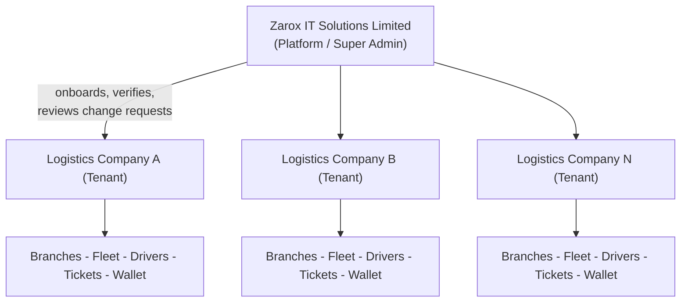

# Software Requirements Document (SRD)
# Da Logistics Manager (DLM)

**Document Control**

| Field | Value |
|---|---|
| Product | Da Logistics Manager (DLM) |
| Owner / Operator | Zarox IT Solutions Limited |
| Document Version | 0.1 (Draft) |
| Date | July 3, 2026 |
| Status | Draft — for review |
| Related Documents | `DLM_SDD.md`, `DLM_Screens.md`, `DLM_DTOs.md` |

---

## 1. Introduction

### 1.1 Purpose
This document specifies the functional and non-functional requirements for Da Logistics Manager (DLM), a multi-tenant SaaS platform owned and operated by Zarox IT Solutions Limited ("the Platform" / "Zarox") that logistics and haulage companies ("Tenants" / "Entities") subscribe to in order to manage their fleet, drivers, shipments, and operational metrics.

### 1.2 Scope
DLM provides:
- Self-service tenant registration with Platform-side verification
- Two-tier role-based access control (Platform roles and Tenant roles)
- A tenant wallet for funding platform usage
- Subscription-only billing for platform access
- Fleet ("Carriage") and driver management
- Ticket management — the operational core, representing individual haulage jobs from creation through delivery
- Real-time location tracking ("Tracker") of vehicles on active tickets
- Public shipment tracking links for consignees
- Operational and platform-wide metrics/analytics
- A controlled Change Request workflow for identity-sensitive fields
- Audit logging of sensitive actions

Out of scope for this version (see §2.7 Release Phasing): multi-currency wallets, native GPS-hardware firmware, ML-based fraud detection, spot-market/bidding features, cross-border customs documentation, and per-ticket DLM usage billing.

### 1.3 Definitions, Acronyms, Abbreviations

| Term | Definition |
|---|---|
| DLM | Da Logistics Manager — this product |
| Platform | Zarox IT Solutions Limited, the owner/operator of DLM |
| Tenant / Entity | A logistics company using DLM within its own isolated workspace |
| Branch | A physical location (depot/office) belonging to a Tenant |
| Ticket | An operational job order representing movement of cargo from an origin to a destination |
| Carriage | The fleet/vehicle management module |
| Tracker | The real-time GPS location-tracking capability |
| Wallet | A Tenant's prepaid balance used to pay for platform usage |
| Subscription | A recurring paid plan that grants a Tenant access to DLM |
| Ticket Price | The Tenant's customer-facing haulage charge for the shipment; not a DLM platform fee |
| RBAC | Role-Based Access Control |
| POD | Proof of Delivery |
| ETA | Estimated Time of Arrival |
| NDPA | Nigeria Data Protection Act, 2023 |
| KYC | Know-Your-Business verification performed at onboarding |
| CAC | Corporate Affairs Commission (Nigeria's business registrar) |

### 1.4 References
None — this is a greenfield product. This SRD is the primary source of truth for scope; the SDD, Screens, and DTOs documents implement it.

---

## 2. Overall Description

### 2.1 Product Perspective
DLM is a new, standalone, multi-tenant B2B SaaS product. It is not an extension of an existing system.

Two tiers of participants exist:

Each Tenant's data is fully isolated from every other Tenant. Zarox, as Platform owner, has cross-tenant visibility for administration, support, and billing oversight, but does not participate in a Tenant's day-to-day dispatch operations.

### 2.2 Product Functions
At a high level, DLM provides:
1. Tenant registration, verification, and profile management
2. Authentication and role-based access control (Platform + Tenant scopes)
3. Wallet / fund management
4. Fleet ("Carriage") management
5. Driver management
6. Ticket management (job lifecycle)
7. Real-time tracking
8. Metrics & analytics dashboards
9. Notifications
10. Change Request workflow for locked fields
11. Audit logging

### 2.3 User Classes and Characteristics

| Role | Scope | Description | Technical Proficiency |
|---|---|---|---|
| Super Admin | Platform | Zarox staff; full control of the platform, tenant approval, billing oversight | High |
| Platform Support | Platform | Zarox support staff; read access to tenant support context, including PII and wallet data, but no financial/manual adjustment or approval authority | Medium–High |
| Company Admin | Tenant | Owns the tenant workspace; manages users, settings, submits change requests | Medium |
| Fleet Manager | Tenant | Manages vehicles and drivers | Medium |
| Dispatcher | Tenant | Creates and assigns tickets, monitors live operations | Medium |
| Finance Officer | Tenant | Manages wallet funding and financial reporting | Medium |
| Driver | Tenant (mobile) | Executes assigned tickets via mobile app; sends location | Low–Medium |
| Viewer | Tenant | Read-only access (auditors, investors, ops overseers) | Low |

### 2.4 Operating Environment
- Web portals (Super Admin, Company): modern evergreen browsers (Chrome, Edge, Firefox, Safari — last 2 versions), desktop and tablet widths.
- Driver app: installable PWA for MVP, designed for intermittent 3G/4G connectivity typical of on-road use in Nigeria. Native mobile (React Native / Expo) may be adopted later if reliable background GPS becomes a hard requirement.
- Backend: containerized services on Kubernetes, cloud-hosted (any standard cloud or Nigerian/African data-center provider satisfying NDPA data-residency preferences).

### 2.5 Design and Implementation Constraints
- Must enforce strict Tenant data isolation at the data-access layer, not only the UI.
- Company Name and Branch Geolocation are immutable outside the Change Request workflow (see §3.10).
- Must comply with NDPA 2023 for all personal data (drivers, contacts, consignees).
- Primary currency is NGN; architecture should not hard-code single-currency assumptions where reasonably avoidable, to ease later expansion.

### 2.6 Assumptions and Dependencies
- Zarox IT Solutions Limited is the Platform vendor; logistics companies are subscribing Tenants (true multi-tenant SaaS, not a single bespoke deployment).
- "Ticket" refers to a trip/job/consignment order, not a customer-support ticket.
- "Tracker" refers to GPS-based location tracking tied to active tickets, sourced primarily from the driver's mobile device, with hardware-tracker integration as a Phase 2 option.
- Drivers are Tenant employees operating within a company fleet (not an independent gig marketplace).
- DLM billing is subscription-only for MVP. Ticket prices are Tenant operational/customer charges for reporting; they do not create DLM wallet debits.
- Only the branch **geolocation** (coordinates) and the **company name** are request-locked; phone, textual addresses, and password follow normal self-service edit/reset flows.
- Tenant KYC should collect CAC registration number, CAC certificate upload, registered address, primary contact person, official email/phone verification, and at least one verified branch geolocation. Tax Identification Number (TIN) is recommended but optional for MVP.
- Paystack is the default payment provider for MVP. Availability of an SMS/email provider and a maps/geocoding provider is also assumed.

### 2.7 Release Phasing (Recommended)

| Phase | Scope |
|---|---|
| **Phase 1 — MVP** | Tenant registration & verification with KYC, RBAC (all core roles), Wallet funding via Paystack, subscription-only billing, downloadable wallet statements/invoices, Fleet & Driver CRUD, full Ticket lifecycle, driver-assignment accept/reject flow, driver-app/PWA GPS tracker + live map, ETA display, public shareable tracking link, driver performance scorecards, core metrics dashboard, Change Request workflow, audit log (core actions), in-app/email/SMS notifications |
| **Phase 2** | Optional MFA for Platform and Company Admin roles, geofencing alerts, hardware GPS-tracker ingestion, advanced analytics export, native React Native / Expo driver app if background tracking requires it |
| **Phase 3 — Exploratory** | ML-based anomaly/fraud detection on wallet and driver behavior (Python service), multi-currency wallet, regional expansion, spot-haulage marketplace/bidding |

---

## 3. Functional Requirements

Requirement IDs use the pattern `FR-<MODULE>-<NN>`.

### 3.1 Tenancy & Registration (`TEN`)
- **FR-TEN-01**: The system shall allow a prospective logistics company to self-register, providing: company name, phone, email, company address, CAC registration number, CAC certificate, primary contact person, at least one branch (name, address, geolocation), and a password for the initial Company Admin account.
- **FR-TEN-02**: Company Name and Branch Geolocation shall be locked after registration; they may only be changed via an approved Change Request (§3.10).
- **FR-TEN-03**: Company phone, company address text, and branch address text shall be directly editable by a Company Admin.
- **FR-TEN-04**: New tenant registrations shall enter a `PENDING_VERIFICATION` state and require Super Admin approval before becoming `ACTIVE`.
- **FR-TEN-05**: A Tenant shall be able to register multiple branches, each with its own address and geolocation.
- **FR-TEN-06**: The system shall enforce full data isolation between Tenants at the data-access layer.
- **FR-TEN-07**: Super Admin shall be able to suspend, reactivate, or deactivate a Tenant account.
- **FR-TEN-08**: Super Admin shall review Tenant KYC information before approving or rejecting a Tenant registration.

### 3.2 Authentication & RBAC (`RBAC`)
- **FR-RBAC-01**: The system shall authenticate users via email/phone + password, with passwords stored using a modern salted hash (Argon2id or bcrypt).
- **FR-RBAC-02**: The system shall issue short-lived JWT access tokens and longer-lived refresh tokens.
- **FR-RBAC-03**: The system shall support two Platform roles (`SUPER_ADMIN`, `PLATFORM_SUPPORT`) and six Tenant roles (`COMPANY_ADMIN`, `FLEET_MANAGER`, `DISPATCHER`, `FINANCE_OFFICER`, `DRIVER`, `VIEWER`) — see Appendix A for the full permission matrix.
- **FR-RBAC-04**: Company Admin shall be able to invite, deactivate, and reassign roles for users within their own Tenant only.
- **FR-RBAC-05**: Driver accounts shall be restricted to the mobile app and to their own assigned tickets/profile — no access to the web dashboard.
- **FR-RBAC-06**: The system shall support self-service password reset via a time-limited token sent to the registered email/phone.
- **FR-RBAC-07**: MVP authentication shall use normal email/phone + password with JWT access/refresh tokens. Optional multi-factor authentication is deferred to Phase 2.
- **FR-RBAC-08**: Platform Support shall be able to view Tenant support context, including PII and wallet data, but shall not approve tenants, approve change requests, adjust wallets, or mutate Tenant operational records.
- **FR-RBAC-09**: Super Admin shall be able to invite, deactivate, and reassign roles for Platform users (`SUPER_ADMIN`, `PLATFORM_SUPPORT`). Platform Support shall have read-only visibility into Platform user lists and no authority to manage Platform users.

### 3.3 Wallet & Fund Management (`WAL`)
- **FR-WAL-01**: Each Tenant shall have exactly one primary wallet, denominated in NGN.
- **FR-WAL-02**: Finance Officer or Company Admin shall be able to fund the wallet via Paystack-supported payment methods (card, bank transfer, or USSD where available).
- **FR-WAL-03**: Every wallet balance change shall be recorded as an immutable `WalletTransaction`; balances shall never be mutated directly.
- **FR-WAL-04**: The system shall debit the wallet automatically according to the Tenant's subscription plan and billing cycle. Per-ticket DLM usage billing is out of scope for MVP.
- **FR-WAL-05**: The system shall notify the Tenant when the wallet balance falls below a configurable threshold.
- **FR-WAL-06**: The system shall restrict creation of new tickets when a Tenant's subscription is unpaid beyond the configured grace period, while allowing already-active tickets to continue to completion.
- **FR-WAL-07**: Super Admin shall be able to view all Tenant wallets and transaction histories, and perform manual adjustments with a mandatory reason (logged to the Audit Log).
- **FR-WAL-08**: The system shall generate downloadable wallet statements and subscription invoices per period (CSV/PDF).
- **FR-WAL-09**: Paystack payment webhooks shall be signature-verified, idempotently processed, and reconciled against stored payment references before wallet credit is posted.
- **FR-WAL-10**: The system shall maintain subscription plans and Tenant subscription state (`ACTIVE`, `PAST_DUE`, `GRACE_PERIOD`, `SUSPENDED`, `CANCELLED`).

### 3.4 Fleet / Carriage Management (`FLT`)
- **FR-FLT-01**: Fleet Manager shall be able to register a vehicle with: plate number, type (truck/van/trailer/bike/other), make/model, capacity, year, ownership (owned/leased).
- **FR-FLT-02**: Vehicle status shall follow the lifecycle: `ACTIVE`, `ON_TRANSIT`, `UNDER_MAINTENANCE`, `INACTIVE`, `DECOMMISSIONED`.
- **FR-FLT-03**: The system shall prevent assigning a vehicle that is already `ON_TRANSIT` to a second concurrent ticket.
- **FR-FLT-04**: The system shall track vehicle documents (insurance, roadworthiness, registration) with expiry dates and shall alert ahead of expiry.
- **FR-FLT-05**: The system shall maintain a maintenance log per vehicle.
- **FR-FLT-06**: A vehicle shall have a current default driver, reassignable per ticket.

### 3.5 Driver Management (`DRV`)
- **FR-DRV-01**: Fleet Manager shall be able to register a driver with: full name, phone, email (optional), license number and expiry, NIN (optional), photo, and date joined.
- **FR-DRV-02**: Driver status shall follow the lifecycle: `ACTIVE`, `ON_TRIP`, `INACTIVE`, `SUSPENDED`.
- **FR-DRV-03**: A driver record may be linked to a mobile-app user account, either auto-provisioned or admin-invited.
- **FR-DRV-04**: The system shall track driver performance history (tickets completed, on-time rate, rejection count, dispute count) for the Metrics module and driver scorecards.
- **FR-DRV-05**: The system shall alert ahead of driver license expiry and shall block trip assignment for drivers with expired licenses.

### 3.6 Ticket Management (`TCK`)
- **FR-TCK-01**: Dispatcher shall be able to create a Ticket with: auto-generated ticket number, origin, destination, cargo description, weight/volume, consignee details (name, phone, address), requested pickup time, priority, and optional customer-facing ticket price.
- **FR-TCK-02**: Ticket status shall follow the lifecycle: `DRAFT` → `PENDING_ASSIGNMENT` → `ASSIGNED` → `IN_TRANSIT` → `DELIVERED` → `CLOSED`, with `CANCELLED` and `DISPUTED` as side/terminal states.
- **FR-TCK-03**: Dispatcher shall assign a vehicle and driver to a ticket; the assignment shall require driver acceptance via the mobile app before the ticket becomes `ASSIGNED`.
- **FR-TCK-04**: Driver shall be able to accept or reject an assignment. Rejection shall return the ticket to `PENDING_ASSIGNMENT`, release the proposed driver/vehicle, record a reason if supplied, and allow the company to assign another driver/vehicle.
- **FR-TCK-05**: Driver shall be able to start a trip (→ `IN_TRANSIT`), update checkpoints, and mark delivery complete (→ `DELIVERED`) with Proof of Delivery (photo and/or signature).
- **FR-TCK-06**: Dispatcher or Company Admin shall verify a delivered ticket and close it (→ `CLOSED`). The system may auto-close delivered tickets after a configurable period (recommended default: 72 hours) if no dispute is raised.
- **FR-TCK-07**: Every status transition shall be timestamped and retained in a `TicketStatusHistory` record.
- **FR-TCK-08**: Tickets may be cancelled with a mandatory reason, subject to role permissions.
- **FR-TCK-09**: Ticket price, when supplied, represents the Tenant's customer-facing haulage amount for reporting and does not trigger a DLM wallet debit.
- **FR-TCK-10**: The system shall support attaching documents (waybill, invoice) to a ticket.
- **FR-TCK-11**: The system shall generate a public, no-login tracking link for a ticket, showing status and (while `IN_TRANSIT`) an approximate live location to the consignee.

### 3.7 Tracker — Real-Time Location (`TRK`)
- **FR-TRK-01**: The driver PWA shall transmit periodic location pings (default: every 15–30 seconds) while a ticket is `IN_TRANSIT`.
- **FR-TRK-02**: The Tenant dashboard shall display live vehicle locations on a map for all tickets currently `IN_TRANSIT`.
- **FR-TRK-03**: The system shall retain a location-ping history per ticket for route audit and analysis.
- **FR-TRK-04**: The system shall compute and display an ETA for in-transit tickets.
- **FR-TRK-05** *(Phase 2)*: The system shall support geofencing alerts (route deviation, arrival at destination).
- **FR-TRK-06** *(Phase 2)*: The system shall support ingesting location data from third-party GPS hardware trackers as an alternative/supplement to the driver app.

### 3.8 Metrics & Analytics (`MET`)
- **FR-MET-01**: The Tenant dashboard shall display: active/completed/cancelled ticket counts, fleet utilization %, average turnaround time, on-time delivery %, wallet balance and spend trend.
- **FR-MET-02**: The Platform (Super Admin) dashboard shall display: total/active/pending tenants, platform-wide ticket volume, total revenue, tenant growth trend, system health indicators.
- **FR-MET-03**: Metrics shall be filterable by date range, branch, vehicle, and driver.
- **FR-MET-04**: Reports shall be exportable as CSV/PDF.
- **FR-MET-05**: Driver scorecards shall show tickets completed, on-time rate, acceptance/rejection count, dispute count, and average turnaround time.

### 3.9 Notifications (`NOT`)
- **FR-NOT-01**: The system shall send notifications (in-app and email; SMS for critical events) for: ticket assignment, ticket status changes, low wallet balance, document expiry, Change Request decisions, and Tenant status changes.
- **FR-NOT-02**: Users shall be able to configure notification channel preferences for non-critical notification types.

### 3.10 Change Request Workflow (`CRQ`)
- **FR-CRQ-01**: Company Admin shall be able to submit a Change Request for a locked field (Company Name or Branch Geolocation) with a reason and optional supporting document.
- **FR-CRQ-02**: Super Admin shall review each Change Request and Approve or Reject it, with an optional note.
- **FR-CRQ-03**: An approved Change Request shall automatically apply the change and log it to the Audit Log; a rejected request shall notify the Tenant with the stated reason.

### 3.11 Audit Log (`AUD`)
- **FR-AUD-01**: The system shall maintain an immutable audit trail of sensitive actions: locked-field changes, wallet manual adjustments, role changes, ticket cancellations, admin-level login events, Platform Support access to PII/wallet detail pages, and exports/downloads containing PII or wallet data.
- **FR-AUD-02**: Super Admin shall be able to search and filter the audit log by actor, tenant, entity type, and date range.

---

## 4. Non-Functional Requirements

| Category | Requirement |
|---|---|
| **Performance** | API p95 latency < 300ms for standard reads; dashboard initial load < 2s; location-ping ingestion sized for one ping per active vehicle every 15–30s at full tenant load |
| **Scalability** | Stateless API instances horizontally scalable behind a load balancer (Kubernetes HPA); database schema designed to scale across a growing number of tenants and tickets |
| **Security** | TLS 1.2+ in transit, encryption at rest for the database and object storage, Argon2id/bcrypt password hashing, RBAC enforced at the API layer (not only UI), rate limiting on auth endpoints, dependency vulnerability scanning in CI |
| **Availability** | Target 99.5% uptime for MVP; documented RTO/RPO for database backups |
| **Usability** | Responsive dashboards (desktop/tablet); driver app usable on low/intermittent bandwidth, with an offline-tolerant update queue that syncs when connectivity returns |
| **Compliance** | NDPA 2023 lawful-basis handling of personal data (drivers, consignees); `source_provenance`-style tracking on personal-data-bearing tables; documented data-retention policy; card data never touches DLM servers directly (PCI scope offloaded to Paystack) |
| **Maintainability** | Modular API structure aligned to the functional modules in §3; API versioning (`/api/v1`); CI/CD with automated tests before deploy |
| **Auditability** | All state-changing actions on sensitive entities are logged with actor, timestamp, before/after values |

---

## 5. External Interface Requirements

- **User Interfaces**: Responsive web app for Super Admin and Company portals (latest two versions of major browsers); installable PWA driver app for MVP.
- **Hardware Interfaces** *(Phase 2)*: Optional ingestion from third-party GPS hardware trackers via MQTT or HTTP webhook.
- **Software Interfaces**: Paystack payment API and webhooks, SMS gateway, email/SMTP provider, maps/geocoding API.
- **Communication Interfaces**: REST/JSON over HTTPS; WebSocket for live tracker push; inbound webhooks from Paystack.

---

## 6. Business Rules

- **BR-01**: A vehicle may be reserved or assigned to only one non-terminal-status ticket at a time. A pending driver response (`PENDING_DRIVER_RESPONSE`) reserves the proposed vehicle until the assignment is accepted, rejected, cancelled, or expired.
- **BR-02**: A driver may be reserved or assigned to only one non-terminal-status ticket at a time. A pending driver response (`PENDING_DRIVER_RESPONSE`) reserves the proposed driver until the assignment is accepted, rejected, cancelled, or expired.
- **BR-03**: Company Name and Branch Geolocation can only change via an approved Change Request.
- **BR-04**: A wallet balance cannot go negative except within an explicitly configured credit/grace limit.
- **BR-05**: A ticket cannot move to `IN_TRANSIT` without both an assigned vehicle and a driver who has accepted.
- **BR-06**: Only Super Admin can approve tenant registration and Change Requests.
- **BR-07**: A driver's mobile-app access is suspended automatically if their status is `SUSPENDED`/`INACTIVE` or their license has expired.
- **BR-08**: Monetary values are stored in kobo (smallest NGN unit) to avoid floating-point rounding errors, and displayed in Naira.
- **BR-09**: Every wallet debit/credit ties to an immutable `WalletTransaction`.
- **BR-10**: No Tenant's data is ever visible to another Tenant, under any role.
- **BR-11**: A rejected assignment returns the ticket to `PENDING_ASSIGNMENT`; the rejected driver/vehicle are released for other work.
- **BR-12**: A ticket can move from `DELIVERED` to `CLOSED` only by Dispatcher or Company Admin verification, or by an auto-close job after the configured no-dispute window.
- **BR-13**: Ticket prices are stored for Tenant reporting only and never create DLM wallet debits in the subscription-only MVP.
- **BR-14**: Ticket creation is blocked for `PAST_DUE` subscriptions only after the configured grace period; active in-transit tickets must remain completable.
- **BR-15**: Paystack webhook events must be processed exactly once per unique Paystack reference/event id.

---

## 7. Use Case Summary

| ID | Use Case | Primary Actor | Summary |
|---|---|---|---|
| UC-01 | Register Tenant | Prospective Company Admin | Company signs up with branch + geolocation details, awaits verification |
| UC-02 | Approve/Reject Tenant | Super Admin | Reviews and decides on a new tenant registration |
| UC-03 | Submit Change Request | Company Admin | Requests a change to a locked field |
| UC-04 | Review Change Request | Super Admin | Approves or rejects a pending change request |
| UC-05 | Fund Wallet | Finance Officer | Adds funds via Paystack |
| UC-06 | Register Vehicle | Fleet Manager | Adds a vehicle with documents |
| UC-07 | Register Driver | Fleet Manager | Adds a driver, optionally invites to mobile app |
| UC-08 | Create Ticket | Dispatcher | Creates a new job order |
| UC-09 | Assign Ticket | Dispatcher | Assigns vehicle + driver to a pending ticket |
| UC-10 | Execute Trip | Driver | Accepts, starts, updates, and completes a ticket with POD |
| UC-11 | View Live Tracker | Company Admin / Dispatcher | Views real-time vehicle locations on a map |
| UC-12 | View Metrics | Company Admin / Super Admin | Views operational or platform-wide metrics |
| UC-13 | Public Shipment Tracking | Customer/Consignee | Tracks a ticket via a shareable public link |
| UC-14 | Manage Tenant Users | Company Admin | Invites users and assigns RBAC roles |
| UC-15 | Review Audit Log | Super Admin | Searches/filters the platform audit trail |

---

## 8. High-Level Data Requirements
Full attribute-level data contracts are defined in `DLM_DTOs.md`; entity relationships are defined in `DLM_SDD.md` §6. At minimum the system must persist: Tenant, Branch, User, Role, SubscriptionPlan, TenantSubscription, Wallet, WalletTransaction, PaymentWebhookEvent, Vehicle, VehicleDocument, Driver, Ticket, TicketAssignment, TicketAttachment, ProofOfDelivery, TicketStatusHistory, LocationPing, ChangeRequest, Notification, and AuditLogEntry.

---

## Appendix A — Role–Permission Matrix

| Module | Super Admin | Platform Support | Company Admin | Fleet Manager | Dispatcher | Finance Officer | Driver | Viewer |
|---|---|---|---|---|---|---|---|---|
| Tenant Settings | Full | View incl. PII | Edit (non-locked) | — | — | — | — | View |
| Change Requests | Approve/Reject | View | Create | — | — | — | — | View |
| User Management | Full (platform) | View | Full (tenant) | — | — | — | — | — |
| Wallet | View all + Adjust | View all | View | — | — | Fund + View | — | View |
| Fleet (Vehicles) | View all | View | Full | Full | View | — | View own | View |
| Drivers | View all | View | Full | Full | View | — | View own | View |
| Tickets | View all | View | Full | View | Full | View | Update assigned | View |
| Tracker | View all | View | View | View | View | — | Send location | View |
| Metrics | Platform-wide | Platform-wide | Tenant-wide | Fleet-scoped | Ops-scoped | Finance-scoped | — | Tenant-wide |
| Audit Log | Full | View | Tenant-scoped | — | — | — | — | — |

*(End of SRD)*
